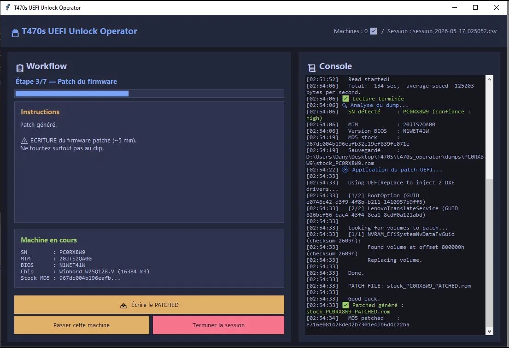

# T470s UEFI Unlock Operator

> Outil graphique pour déverrouiller en série le mot de passe BIOS Supervisor
> des ThinkPad T470s (et compatibles) via un programmateur CH341A.
>
> Graphical tool to bulk-unlock the BIOS Supervisor password on ThinkPad
> T470s (and compatible) laptops using a CH341A flash programmer.

[](https://python.org)
[](LICENSE)
[]()
[]()



---

🇫🇷 [Documentation Française](#-version-française) — 🇬🇧 [English Documentation](#-english-version)

---

## 🇫🇷 Version française

### 📖 Description

**T470s UEFI Unlock Operator** est une application Windows pour déverrouiller
le mot de passe BIOS Supervisor de ThinkPad T470s (et autres modèles
compatibles utilisant la même puce SPI). C'est un outil destiné aux ateliers
de reconditionnement, à la récupération de matériel d'occasion, ou à
l'auto-réparation.

Le projet est né du besoin de débloquer 11 ThinkPad T470s rachetés au
reconditionnement pour revente. Plutôt que de répéter manuellement la
procédure (avec les risques d'erreur que ça implique sur 11 machines), j'ai
construit une interface qui guide étape par étape, garde un log CSV de
chaque machine, et calcule les MD5 stock / patched pour s'assurer qu'on ne
mélange jamais les firmwares.

#### ⚠️ Disclaimer

Cet outil **modifie le firmware** de votre laptop en utilisant un
programmateur externe. Une mauvaise manipulation peut **briquer** la machine.
Vous êtes seul responsable de l'usage que vous en faites. Utilisez-le
uniquement sur du matériel dont vous êtes propriétaire ou que vous avez le
droit légal de modifier.

#### Pourquoi cet outil ?

- ✅ **Workflow guidé** : impossible de sauter une étape critique
- ✅ **Progression temps réel** pour la lecture/écriture (contrairement à
  flashrom 1.4 qui bufferise sa sortie)
- ✅ **Détection automatique du SN/MTM/BIOS** depuis le dump SPI
- ✅ **Log CSV** automatique pour la traçabilité
- ✅ **Calcul MD5** des dumps stock + patched (impossible de remettre le
  mauvais firmware sur une machine)
- ✅ **Vérification après chaque écriture** (compare la puce au fichier source)
- ✅ **Mode bilingue** (FR / EN)
- ✅ **Thème sombre**, installeur intégré

### 🛠 Matériel requis

| Item | Détail |
|---|---|
| ThinkPad T470s | Ou modèle compatible avec puce Winbond W25Q128.V (16 Mo) |
| Programmateur CH341A | Le modèle USB standard noir, ~10 € sur AliExpress |
| Clip SOIC-8 | Le pince-test pour brancher sur la puce sans dessouder |
| PC Windows 10/11 (x64) | Pour faire tourner l'app |
| Tournevis | Pour démonter le fond du laptop |

### 📥 Installation

#### 1. Télécharger le projet

```bash
git clone https://github.com/Dany33600/t470s-uefi-unlock-operator.git
```

Ou télécharger l'archive ZIP depuis l'onglet **[Releases](https://github.com/Dany33600/t470s-uefi-unlock-operator/releases)** du dépôt.

#### 2. Lancer `start.bat`

Le script :
1. Détecte Python (l'installe automatiquement s'il manque, via l'installeur
   officiel python.org)
2. Affiche le sélecteur de langue (premier lancement uniquement)
3. Lance l'installeur de composants (flashrom, ch341prog, Zadig)
4. Lance l'application

**Aucune dépendance pip à installer** — tout est inclus ou téléchargé
automatiquement.

#### 3. Installer le driver USB du CH341A

Quand l'installeur vous y invite, lancez **Zadig** (en administrateur,
proposé automatiquement) :

1. Menu **Options** → ☑ **List All Devices**
2. Dans la liste : sélectionnez **USB EEPROM Board** (ou similaire,
   VID:1A86 PID:5512)
3. Choisissez le driver **WinUSB** (à droite)
4. Cliquez sur **Replace Driver**

Cette opération est à faire **une seule fois** par PC.

### 🎮 Utilisation

Pour chaque machine, suivez le workflow guidé :

| Étape | Description | Durée |
|---|---|---|
| 1 | Détection CH341A + puce SPI | ~5s |
| 2 | Lecture du firmware stock | ~2min 15 |
| 3 | Patch UEFI (autopatcher Lenovo) | ~10s |
| 4 | Écriture du firmware patché + vérification | ~5min |
| 5 | Séquence BIOS manuelle (F1 → password bidon → Space×2) | ~30s |
| 6 | Restauration du firmware stock + vérification | ~5min |
| 7 | Test boot + validation | ~30s |

**Temps total par machine : ~13-15 min.**

#### Procédure physique (à chaque machine)

1. **Débrancher** les **2 batteries** du ThinkPad (principale + CMOS sur la
   carte mère). Sans ça, la puce n'acceptera pas l'écriture externe.
2. **Brancher** le clip SOIC-8 sur la puce SPI (ligne rouge alignée avec le
   point/encoche de la puce).
3. **Connecter** le CH341A en USB.
4. Cliquer ▶ **Démarrer cette machine** dans l'app et suivre les instructions.
5. À la fin, **débrancher** le clip, **rebrancher** les batteries, **tester
   le boot**.

#### Sortie générée

```
t470s_operator/
├── dumps/
│   └── PC0RX863/
│       ├── stock_PC0RX863.rom         ← firmware d'origine
│       └── stock_PC0RX863_patched.rom ← firmware patché
├── reports/
│   └── session_2026-05-16_223045.csv  ← journal CSV de la session
└── logs/
    └── session_2026-05-16_223045.log  ← log texte complet (debug)
```

Le **CSV** contient pour chaque machine : SN, MTM, version BIOS, durée,
MD5 stock+patched, vérifications, statut, notes.

### 🩹 Dépannage

| Problème | Solution |
|---|---|
| `Failed to detach kernel driver: 'Not enough space'` | Vous avez une vieille version du `ch341prog.exe`. Réinstaller depuis le zip. |
| `Couldn't open device [1a86:5512]` | Driver WinUSB non installé. Relancer Zadig (proposé par l'app). |
| `chip not found` | Le clip est mal positionné. Vérifier l'orientation (ligne rouge ↔ point). |
| Lecture/écriture lente | Normal, CH341A = ~125 Ko/s. Soit ~2min 15 pour 16 Mo. |
| `flashrom: failed to read ID` | Batteries non débranchées. Une seule alimentation peut interférer. |
| BIOS demande toujours un password après le patch | La séquence F1→password bidon→Space×2 n'a pas été faite correctement. Recommencer. |

### 🔧 Architecture

```
t470s_operator/
├── start.bat                     ← bootstrap : Python + langue + install + app
├── config.json                   ← chemins + langue (généré au 1er run)
├── app/
│   ├── operator_gui.py           ← UI principale (Tkinter)
│   ├── ch341prog_wrapper.py      ← wrapper Python pour ch341prog.exe
│   ├── flashrom_wrapper.py       ← wrapper Python pour flashrom.exe
│   ├── autopatch_wrapper.py      ← wrapper pour l'autopatcher Lenovo
│   ├── sn_extractor.py           ← extraction SN/MTM/BIOS depuis le dump
│   ├── session_logger.py         ← écriture du CSV
│   ├── zadig_wizard.py           ← assistant d'install du driver
│   ├── language_selector.py      ← dialog de sélection de langue
│   └── i18n.py                   ← traductions FR/EN
├── installer/
│   └── installer.py              ← UI d'installation (composants)
├── resources/
│   ├── lenovo_autopatcher_0.2.zip ← autopatcher embarqué
│   └── ch341prog/
│       ├── ch341prog.exe          ← binaire patché pour Windows
│       └── libusb-1.0.dll
└── (généré au runtime)
    ├── tools/                    ← binaires installés (flashrom, ch341prog, Zadig)
    ├── lenovo_autopatcher/       ← autopatcher extrait
    ├── dumps/                    ← dumps SPI par SN
    ├── reports/                  ← CSV de session
    └── logs/                     ← logs texte
```

### 🙏 Crédits & sources

Ce projet n'existerait pas sans le travail de :

- **[Liliana (lilianalillyy)](https://github.com/lilianalillyy/t470s-uefi-unlock)** —
  le tutoriel et le workflow de base pour le T470s
- **Knucklegrumble** (badcaps.net) — l'autopatcher Lenovo qui patche la
  région UEFI pour neutraliser le password Supervisor
- **[flashrom](https://flashrom.org/)** — l'outil de lecture/écriture SPI
  multi-plateforme. Build Windows par
  [therealdreg](https://github.com/therealdreg/flashrom_build_windows_x64).
- **[ch341prog](https://github.com/setarcos/ch341prog)** — alternative à
  flashrom avec vraie progression temps réel (patché pour Windows dans
  ce projet)
- **[libusb](https://libusb.info/)** — la lib USB cross-platform
- **[Zadig](https://zadig.akeo.ie/)** — installeur de driver WinUSB

### 📝 Licence

MIT — voir [LICENSE](LICENSE) pour le texte complet et les licences des
composants tiers embarqués.

### 🤝 Contribuer

Les contributions sont bienvenues ! Ouvrir une
**[Issue](https://github.com/Dany33600/t470s-uefi-unlock-operator/issues)**
pour signaler un bug ou proposer une fonctionnalité, ou une
**[Pull Request](https://github.com/Dany33600/t470s-uefi-unlock-operator/pulls)**
pour soumettre du code.

Idées de contributions :
- Support d'autres ThinkPad (T480, X1 Carbon, etc.)
- Mode batch sans intervention manuelle (séquence BIOS automatisée)
- Traductions supplémentaires (ajout de langues dans `app/i18n.py`)
- Optimisation de la vitesse SPI (option `-d` de ch341prog ?)

### 👤 Auteur

**Dany** — [@Dany33600](https://github.com/Dany33600)

---

## 🇬🇧 English version

### 📖 Description

**T470s UEFI Unlock Operator** is a Windows application to bulk-unlock the
BIOS Supervisor password on ThinkPad T470s (and other compatible models
using the same SPI chip). It's aimed at refurbishment shops, second-hand
hardware recovery, and self-repair.

The project was born from the need to unlock 11 ThinkPad T470s bought from
a refurbishment lot for resale. Rather than manually repeating the procedure
(with all the error risks that implies on 11 machines), I built a GUI that
guides step by step, keeps a CSV log for each machine, and computes MD5
hashes of stock / patched firmwares to make sure we never mix them up.

#### ⚠️ Disclaimer

This tool **modifies the firmware** of your laptop using an external
programmer. Mishandling can **brick** the machine. You are solely
responsible for what you do with it. Only use it on hardware you own or
have the legal right to modify.

#### Why this tool?

- ✅ **Guided workflow** — can't skip a critical step
- ✅ **Real-time progress** for read/write (unlike flashrom 1.4 which
  buffers its output)
- ✅ **Auto-detection** of SN/MTM/BIOS version from the SPI dump
- ✅ **Automatic CSV log** for traceability
- ✅ **MD5 hashes** of stock + patched dumps (impossible to flash the
  wrong firmware to a machine)
- ✅ **Verification after each write** (compares chip to source file)
- ✅ **Bilingual** (FR / EN)
- ✅ **Dark theme**, built-in installer

### 🛠 Hardware required

| Item | Detail |
|---|---|
| ThinkPad T470s | Or compatible model with Winbond W25Q128.V chip (16 MB) |
| CH341A programmer | The black standard USB model, ~10 € on AliExpress |
| SOIC-8 clip | The test clip to attach to the chip without desoldering |
| Windows 10/11 PC (x64) | To run the app |
| Screwdriver | To open the bottom of the laptop |

### 📥 Installation

#### 1. Get the project

```bash
git clone https://github.com/Dany33600/t470s-uefi-unlock-operator.git
```

Or download the ZIP from the **[Releases](https://github.com/Dany33600/t470s-uefi-unlock-operator/releases)** tab.

#### 2. Run `start.bat`

The script:
1. Detects Python (auto-installs if missing, via the official python.org installer)
2. Shows the language selector (first run only)
3. Runs the component installer (flashrom, ch341prog, Zadig)
4. Launches the app

**No pip dependencies to install** — everything is bundled or auto-downloaded.

#### 3. Install the CH341A USB driver

When the installer prompts you, run **Zadig** (with admin rights, offered
automatically):

1. **Options** menu → ☑ **List All Devices**
2. In the list: select **USB EEPROM Board** (or similar, VID:1A86 PID:5512)
3. Pick the **WinUSB** driver (on the right)
4. Click **Replace Driver**

This is a **one-time** setup per PC.

### 🎮 Usage

For each machine, follow the guided workflow:

| Step | Description | Duration |
|---|---|---|
| 1 | Detect CH341A + SPI chip | ~5s |
| 2 | Read stock firmware | ~2min 15 |
| 3 | UEFI patch (Lenovo autopatcher) | ~10s |
| 4 | Write patched firmware + verify | ~5min |
| 5 | Manual BIOS sequence (F1 → bogus password → Space×2) | ~30s |
| 6 | Restore stock firmware + verify | ~5min |
| 7 | Boot test + validation | ~30s |

**Total time per machine: ~13-15 min.**

#### Physical procedure (per machine)

1. **Unplug** both **batteries** of the ThinkPad (main + CMOS on the
   motherboard). Without this, the chip won't accept external writes.
2. **Attach** the SOIC-8 clip to the SPI chip (red wire aligned with the
   dot/notch on the chip).
3. **Connect** the CH341A via USB.
4. Click ▶ **Start this machine** in the app and follow instructions.
5. At the end, **unplug** the clip, **reconnect** batteries, **test boot**.

#### Generated output

```
t470s_operator/
├── dumps/
│   └── PC0RX863/
│       ├── stock_PC0RX863.rom         ← original firmware
│       └── stock_PC0RX863_patched.rom ← patched firmware
├── reports/
│   └── session_2026-05-16_223045.csv  ← session CSV log
└── logs/
    └── session_2026-05-16_223045.log  ← full text log (debug)
```

The **CSV** contains for each machine: SN, MTM, BIOS version, duration,
stock+patched MD5, verifications, status, notes.

### 🩹 Troubleshooting

| Problem | Solution |
|---|---|
| `Failed to detach kernel driver: 'Not enough space'` | You have an old version of `ch341prog.exe`. Reinstall from the zip. |
| `Couldn't open device [1a86:5512]` | WinUSB driver not installed. Re-run Zadig (offered by the app). |
| `chip not found` | The clip is misaligned. Check orientation (red wire ↔ dot). |
| Slow read/write | Normal, CH341A = ~125 KB/s. About 2min 15 for 16 MB. |
| `flashrom: failed to read ID` | Batteries not unplugged. Any power source can interfere. |
| BIOS still asks for a password after patch | The F1→bogus password→Space×2 sequence wasn't done properly. Retry. |

### 🔧 Architecture

See the FR section above — file structure is the same regardless of language.

### 🙏 Credits & sources

This project wouldn't exist without:

- **[Liliana (lilianalillyy)](https://github.com/lilianalillyy/t470s-uefi-unlock)** —
  the original tutorial and workflow for the T470s
- **Knucklegrumble** (badcaps.net) — the Lenovo autopatcher that neutralizes
  the Supervisor password by patching the UEFI region
- **[flashrom](https://flashrom.org/)** — the cross-platform SPI read/write
  tool. Windows build by
  [therealdreg](https://github.com/therealdreg/flashrom_build_windows_x64).
- **[ch341prog](https://github.com/setarcos/ch341prog)** — flashrom
  alternative with real-time progress (patched here for Windows)
- **[libusb](https://libusb.info/)** — cross-platform USB library
- **[Zadig](https://zadig.akeo.ie/)** — WinUSB driver installer

### 📝 License

MIT — see [LICENSE](LICENSE) for full text and embedded third-party licenses.

### 🤝 Contributing

Contributions welcome! Open an
**[Issue](https://github.com/Dany33600/t470s-uefi-unlock-operator/issues)**
for bug reports or feature requests, or a
**[Pull Request](https://github.com/Dany33600/t470s-uefi-unlock-operator/pulls)**
to submit code.

Ideas:
- Support for other ThinkPads (T480, X1 Carbon, etc.)
- Batch mode without manual intervention (automated BIOS sequence)
- Additional translations (add languages to `app/i18n.py`)
- SPI speed optimization (ch341prog `-d` option?)

### 👤 Author

**Dany** — [@Dany33600](https://github.com/Dany33600)
